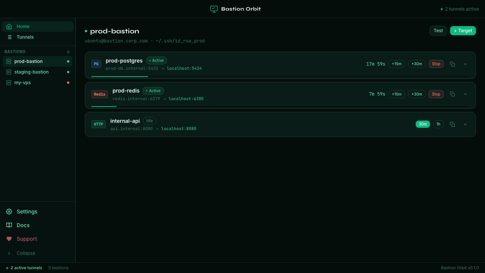
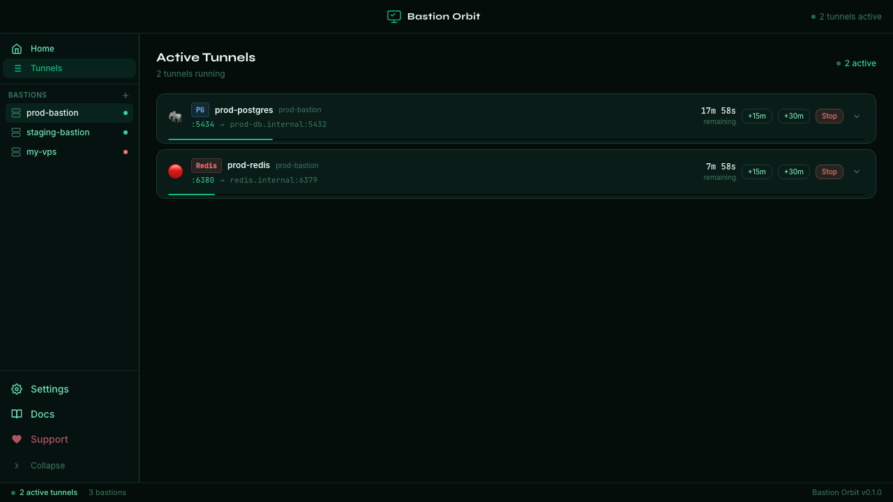
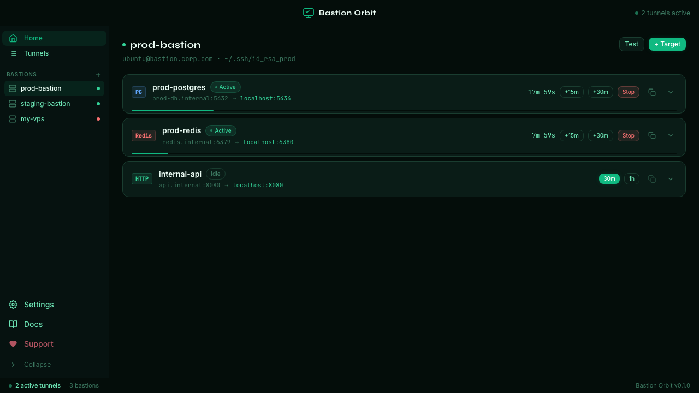
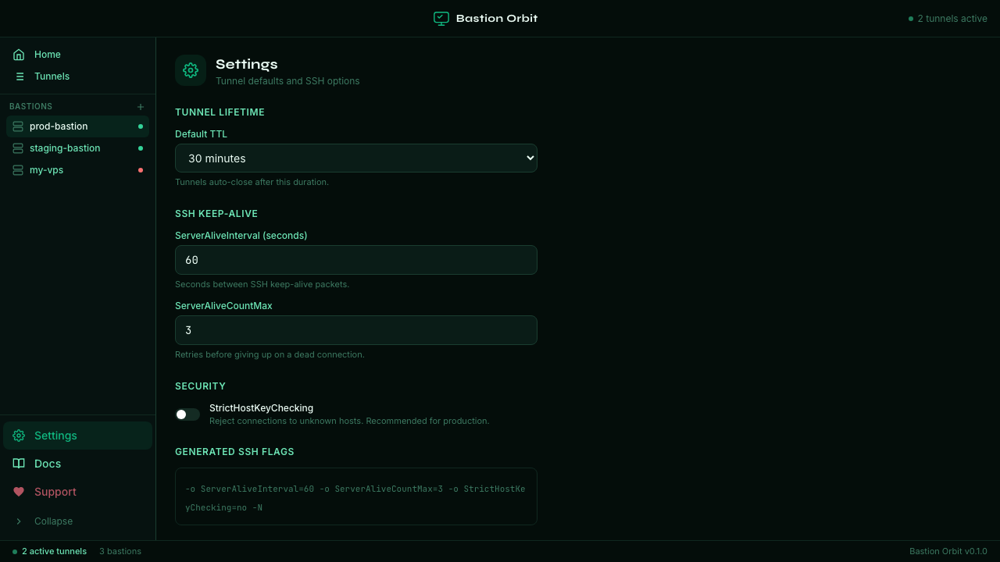

# Bastion Orbit

**SSH tunnel manager for developers.** One click to forward a database or internal service through a bastion host — with auto-expiry timers so you never leave a tunnel open by accident.

Part of the [SlothLabs](https://slothlabs.org) family — native Rust, free forever.

---

## Screenshots

| Home — bastion detail | Active tunnels | Tunnels list |
|---|---|---|
|  |  |  |

| Add bastion wizard | Settings |
|---|---|
|  |  |

---

## Features (v0.1.0)

| Feature | Status |
|---|---|
| Add bastion hosts (host, user, SSH key path) | ✅ |
| Add targets (postgres, redis, http, …) per bastion | ✅ |
| One-click tunnel open with TTL (30m / 1h / custom) | ✅ |
| Auto-close tunnel when TTL expires | ✅ |
| Extend tunnel (+15m / +30m) without stopping | ✅ |
| Stop tunnel instantly | ✅ |
| Copy exact SSH command to clipboard | ✅ |
| SSH command preview per target | ✅ |
| Connectivity test (ssh … exit) | ✅ |
| Remote port probe (nc -z through bastion) | ✅ |
| Offline bastion detection + warning | ✅ |
| Persistent config (bastions + targets in JSON) | ✅ |
| Settings: default TTL, keep-alive, strict host checking | ✅ |

---

## Installation

### Download

Grab the latest `.dmg` / `.exe` / `.AppImage` from the [Releases](https://github.com/slothlabsorg/bastionorbit/releases) page.

### macOS (Homebrew) — coming soon

```bash
brew install slothlabs/tap/bastionorbit
```

---

## Usage

1. **Add a bastion** — click `+ Add bastion`, enter host, user, SSH port, and the path to your private key.
2. **Add a target** — in the bastion detail, click `+ Target`, enter the service name, remote host:port, and local port.
3. **Open a tunnel** — click `30m` or `1h` next to any target. The SSH process starts immediately.
4. **Use the local port** — connect your DB client (e.g. DataOrbit) to `localhost:<localPort>`.
5. **Extend or stop** — use `+15m` / `+30m` to extend, or `Stop` to kill the tunnel.

---

## DataOrbit integration

Open a tunnel to your database via Bastion Orbit, then add a DataOrbit connection pointing to `localhost:<localPort>`. No VPN, no credential sharing — just a clean SSH tunnel.

---

## Development

Requirements: Node 18+, Rust stable, Tauri v2 CLI.

```bash
npm install
npm run tauri dev
```

Browser dev mode (mock data, no Tauri binary):

```bash
npm run dev
# Open http://localhost:1422/?mock=1
```

---

## Testing

```bash
# Unit tests (Vitest)
npm test

# Playwright interaction tests
npm run test:interactions

# Playwright screenshot suite
npm run screenshots
```

Rust unit tests:

```bash
cd src-tauri
cargo test
```

---

## Contributing

1. Fork the repo and create a branch: `git checkout -b my-feature`
2. Make your changes and run the test suites above
3. Open a pull request — all PRs require review before merging to `main`
4. Direct pushes to `main` are disabled

Please keep PRs focused: one feature or fix per PR. For large changes, open an issue first to discuss the approach.

---

## Roadmap

### v0.2
- EC2 Instance Connect / AWS SSM tunnels (integrates with CloudOrbit)
- Bastion groups / tags
- Multiple simultaneous tunnels to same target (different local ports)
- Export bastion config for sharing with teammates

### v0.3
- Auto-reconnect on tunnel drop
- System tray icon with tunnel status
- Notifications on tunnel expiry

---

## Support the project

Bastion Orbit is free and built on nights and weekends. If it saves you time, consider supporting continued development:

- [Ko-fi](https://ko-fi.com/slothlabs)
- [GitHub Sponsors](https://github.com/sponsors/slothlabsorg)
- [Polar.sh](https://polar.sh/slothlabs)

---

## License

MIT © SlothLabs
